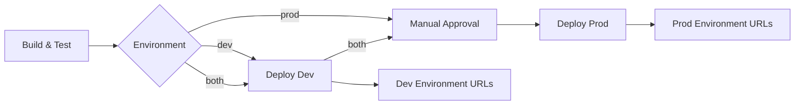

# Multi-Environment CI/CD Deployment Guide 🚀

This guide explains the multi-environment CI/CD setup for Azure Web Content Share, including required GitHub Secrets configuration and deployment workflows.

## 🏗️ Architecture Overview

The deployment system supports three distinct deployment patterns:

1. **Development Only** (`dev`): Deploys to development environment for testing
2. **Production Only** (`prod`): Deploys to production environment (requires approval)
3. **Both Environments** (`both`): Deploys to dev first, then prod with approval gate

### Deployment Flow



## 🔐 Required GitHub Secrets Configuration

The following secrets must be configured in your GitHub repository for multi-environment deployment:

### Repository Secrets (Required for All Environments)

| Secret Name | Description | Example Value |
|-------------|-------------|---------------|
| `AZURE_CLIENT_ID` | Service Principal Client ID for GitHub Actions | `12345678-1234-1234-1234-123456789abc` |
| `AZURE_TENANT_ID` | Azure Tenant ID | `87654321-4321-4321-4321-cba987654321` |
| `AZURE_SUBSCRIPTION_ID` | Azure Subscription ID | `abcdef12-3456-7890-abcd-ef1234567890` |

### Environment-Specific Secrets

#### Development Environment Variables
Configure these as **Repository Variables** (not secrets) for the development environment:

| Variable Name | Description | Example Value |
|---------------|-------------|---------------|
| `FRONTEND_CLIENT_ID` | Azure AD App Registration Client ID for Frontend (Dev) | `frontend-dev-client-id` |

#### Production Environment Secrets
Configure these in the **Production Environment** settings:

| Secret Name | Description | Example Value |
|-------------|-------------|---------------|
| `FRONTEND_CLIENT_ID` | Azure AD App Registration Client ID for Frontend (Prod) | `frontend-prod-client-id` |

## 🛡️ Environment Protection Rules

### Development Environment
- **No protection rules** - deploys automatically on push to main
- **Purpose**: Testing and validation of changes

### Production Environment
- **Required reviewers**: At least 1 approval required
- **Deployment branches**: Only `main` branch allowed
- **Environment secrets**: Production-specific configuration
- **Purpose**: Live production workloads

## 🚀 Deployment Workflows

### Manual Deployment

Use the **Deploy Infrastructure and Applications** workflow with these options:

#### Deploy to Development Only
```yaml
environment: dev
pushContainers: true
skipInfrastructure: false
```

#### Deploy to Production Only (with approval)
```yaml
environment: prod
pushContainers: true
skipInfrastructure: false
```

#### Deploy to Both Environments (dev → prod)
```yaml
environment: both
pushContainers: true
skipInfrastructure: false
```

### Automatic Deployment

- **Push to `main`**: Automatically deploys to development environment
- **Production deployments**: Always require manual trigger and approval

## 🔧 Workflow Features

### Performance Optimizations

1. **Parallel Builds**:
   - .NET API, Jobs, and Frontend build simultaneously
   - Container images build in parallel with dedicated caching

2. **Optimized Container Builds**:
   - Multi-stage builds with proper layer caching
   - Separate cache scopes for each component
   - Environment-specific image tagging

3. **Runtime Configuration**:
   - No build-time secrets in containers
   - Environment-specific configuration injected at runtime
   - Faster builds and more secure deployments

### Security Features

1. **Secret Management**:
   - No secrets embedded in container images
   - Runtime environment variable injection
   - Azure Key Vault integration for application secrets

2. **Environment Isolation**:
   - Separate Azure AD app registrations per environment
   - Environment-specific resource groups and naming
   - Isolated container registries and storage accounts

3. **Access Control**:
   - GitHub environment protection rules
   - Azure RBAC for service-to-service communication
   - Managed Identity authentication

## 📊 Monitoring and Observability

Each environment deployment includes:

- **Application Insights** for telemetry and performance monitoring
- **Structured logging** with environment-specific configuration
- **Health check endpoints** for container readiness probes
- **Deployment summaries** with environment-specific URLs

## 🐛 Troubleshooting

### Common Issues

#### Missing Environment Variables
**Symptom**: Frontend shows configuration errors
**Solution**: Verify `FRONTEND_CLIENT_ID` is configured correctly for the target environment

#### Deployment Approval Timeout
**Symptom**: Production deployment waits indefinitely
**Solution**: Check GitHub environment protection settings and approve pending deployments

#### Container Registry Access
**Symptom**: Image promotion fails from GHCR to ACR
**Solution**: Verify Azure service principal has `AcrPush` role on resource group

### Deployment Logs

Each deployment provides detailed logs including:
- Build and test results
- Container image promotion status
- Environment-specific application URLs
- Smoke test results

### Support Commands

```bash
# Check deployment status
az deployment group list --resource-group rg-awcs-dev --output table

# View container app logs
az containerapp logs show --name ca-awcs-api-<token> --resource-group rg-awcs-dev

# Verify environment variables
az containerapp show --name ca-awcs-frontend-<token> --resource-group rg-awcs-dev --query properties.template.containers[0].env
```

## 🔄 Migration from Single Environment

If migrating from the previous single-environment setup:

1. **Update GitHub Secrets**: Add new environment-specific secrets
2. **Configure Environments**: Set up dev/prod environment protection
3. **Test Deployment**: Run a dev-only deployment first
4. **Verify Configuration**: Ensure runtime config works correctly
5. **Deploy Production**: Use approval-gated production deployment

## 📝 Best Practices

1. **Environment Parity**: Keep dev and prod configurations as similar as possible
2. **Secret Rotation**: Regularly rotate Azure AD client secrets
3. **Monitoring**: Monitor deployment success rates and performance metrics
4. **Testing**: Always test in dev before promoting to prod
5. **Documentation**: Keep environment-specific documentation up to date

---

For additional help, refer to the [main README](../README.md) or check the [Entra ID troubleshooting guide](ENTRA_ID_TROUBLESHOOTING.md).